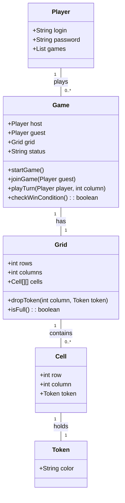
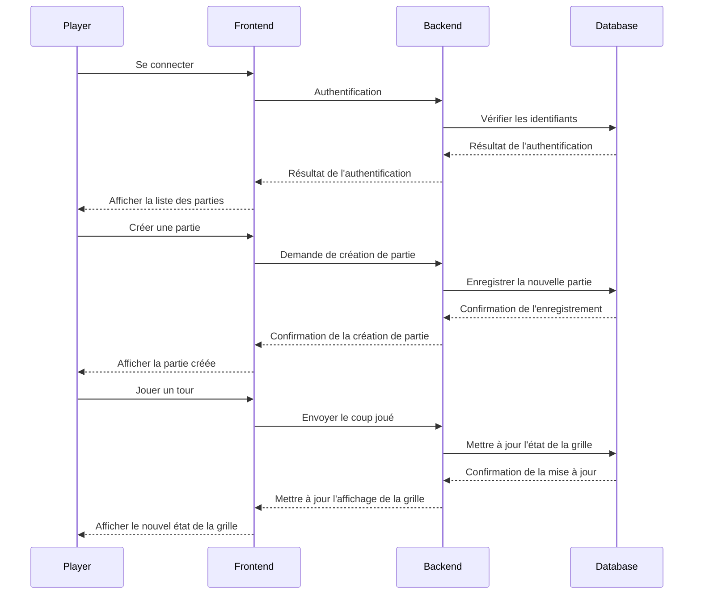

# Puissance 4

Vous devez développer une application qui permet de jouer au puissance 4 en ligne.

## Cahier des charges fonctionnel

Votre client vous fournit une liste de règles fonctionnelles qui doivent être implémentées par votre application.

### Joueurs

L'application possède une liste fermée de joueurs (**Players**).

Chaque joueur possède un identifiant (**Login**) et un mot de passe (**Password**).

Il n'est pas nécessaire de prévoir un système d'enregistrement pour de nouveaux joueurs, la liste pourra être prédéfinie.

### Parties

Une partie (**Game**) est un affrontement entre deux joueurs.

Le joueur peut créer une partie, il est alors hôte de la partie (**Host**).

Le joueur peut rejoindre une partie créée par un autre joueur, il est alors invité de la partie (**Guest**).

La partie ne démarre que lorsqu'un invité l'a rejointe.

L'application doit permettre aux joueur de lister :

- Les parties en attente d'un invité
- Les parties qui attendent une action de la part du joueur
- Les parties auxquelles le joueur a participé

Une partie pourra posséder un statut (ou un état) avec trois valeurs possibles :

- En attente d'un invité (**Awaiting Guest**)
- En cours (**In Progress**)
- Terminée (**Finished**)

### Règles de jeu

Les règles du jeu sont celles du *puissance 4* (**Connect4**).

La partie se déroule sur une grille rectangulaire (**Grid**) constituée de cases (**Cells**).

La largeur de la grille est de 7 colonnes (**Columns**).

La hauteur de la grille est de 6 lignes (**Rows**).

Les joueurs jouent chacun leur tour (**Turn**), en choisissant dans quelle colonne faire tomber leur pion (**Token**).

L'invité est le premier à jouer.

Lorsqu'un joueur a réussi à aligner quatre pions, il gagne la partie.

La partie s'arrète dès qu'un joueur a gagné ou dès que la grille est totalement remplie.

Une fois la partie terminée, il n'est plus possible de jouer.

Si la grille est remplie et qu'aucun joueur n'a gagné, la partie est un match nul.

### Contrôles d'accès

Seuls l'hôte et l'invité d'une partie peuvent jouer dans la partie.

Un joueur ne peut pas jouer à la place d'un autre joueur.

### Diagrammes récapitulatif

## Cahier des charges technique

Votre application doit être conforme aux exigences techniques du client.

### Architecture

Le client souhaite que son application soit modulaire afin d'y ajouter, dans le futur, de nouveaux composants tels qu'une interface mobile en plus de l'interface Web.

Par conséquent, l'application devra respecter une architecture 3-tiers :

- Un tier applicatif qui contient les règles fonctionnelles (logique métier)
- Un tier de présentation avec, pout l'instant, une interface Web
- Un tier d'accès aux données

Il ne sera pas nécessaire d'ajouter d'autres tiers ou d'autres composants.

### Technologies

Vous devez suivre certaines normes technologique afin que l'application livrée corresponde aux normes du client et aux compétences des équipes de maintenance.

#### 1. Tier de présentation (Frontend)

Technologie : ASP.NET Core Blazor pour créer une interface Web interactive.

Responsabilités :

- Afficher les pages de connexion et de liste des parties.
- Permettre aux joueurs de créer, rejoindre et jouer des parties.
- Afficher l’état de la grille et les actions possibles.

#### 2. Tier applicatif (Backend)

Technologie : ASP.NET Core pour les API REST.

Les API devront être correctement sécurisées, être conformes aux conventions de REST et utiliser le format JSON pour la sérialisation.

Responsabilités :

- Gérer la logique métier (création de parties, gestion des tours, vérification des conditions de victoire).
- Authentifier les joueurs et gérer les sessions.
- Communiquer avec le tier d’accès aux données pour stocker et récupérer les informations.

#### 3. Tier d’accès aux données (Database)

Technologie : [SQLite](https://www.sqlite.org/index.html) pour une base de données légère et intégrée.
Responsabilités :

- Stocker les informations sur les joueurs, les parties et les états de la grille.
- Fournir des méthodes pour accéder et manipuler ces données.

### Livrables et tests

Les livrables devront contenir :
- Le code des différents composants
- Une base de données initialisée avec le schéma complet
- Un fichier README qui explique comment lancer votre application
- Un jeu de tests avec notamment les identifiants des utilisateurs à utiliser pour tester l'application
- Un diagramme récapitulatif des entités métier