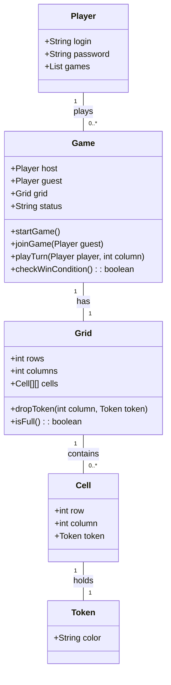
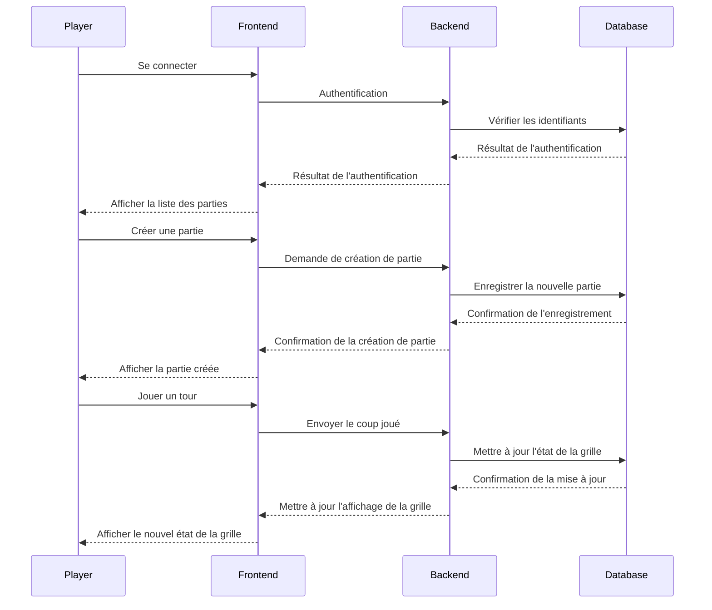

# Projet : Puissance 4

Vous devez développer une application qui permet de jouer au puissance 4 en ligne.

## Attentes du projet

### Entités :

- Player
    - Liste de joueurs
    - Identification **LOGIN** - **PASSWORD**

- Game
    - **HOST / GUEST**
    - Lister les parties :
        - en attente d'un **guest** - **AWAITING GUEST**
        - en attente d'une **action** - **IN PROGRESS**
        - jouées par le player et finies - **FINISHED**

- Grid :
    - **CELLS / ROWS / COLUMNS**
    - alternance des **TURN**

### Diagrammes récapitulatif :

### Cahier des charges technique :

Application 3-tiers :
- **APPLICATIF** - Logique métier
- **PRESENTATION** - Interface Web
- **ACCES DONNEES** - Database + accès

Technos :
- ASP.NET Core Blazor
- ASP.NET Core pour les API REST (Sérialisation en JSON)
- SQLite

### Livrables et tests

Les livrables devront contenir :
- Le code des différents composants
- Une base de données initialisée avec le schéma complet
- Un fichier README qui explique comment lancer votre application
- Un jeu de tests avec notamment les identifiants des utilisateurs à utiliser pour tester l'application
- Un diagramme récapitulatif des entités métier

## Pratiques à mettre en place

- **MODULARITE** : Respecter les principes **SOLID** (notamment l'injection des dépendances)
- **DOMAIN DRIVEN DEVELOPMENT** : Utilisation UL pour rédiger des scénarii / Rédaction de tests d'acceptation
- **SERIALISATION** : Faire attention à la sécurité - JSON
- **WEB SERVICES** : API RESTful / Contrat d'interface / API niv 2
- **SECURITE API** : Utilisation paire ID-PASSWORD en en-tête
- **ORM** : EF comme ORM / Queries - lecture des données sans modification / Commands - Create/Delete/Update / Repository - CRUD directement sur la DB en utilisant EF / Service - Business Logic utilisant uniquement les Respositories
- **SOAR** : Communication asynchrone
- **TESTS** : Utilisation d'un base "InMemory" / Tests unitaires = Services et Respositories / Tests d'intégrations = Services (CRUD) et +
- **WEB** : Blazor en mode WebAssembly pour avoir une page interactive

## Architecture du projet

- **NTiersP4.Domain** : Domain, permet de stocker les interfaces, services et modèles de l'application
- **NTiersP4.Infrastructure** : Implémente les repositories et gère les accès aux données avec la base de données
- **NTiersP4.API** : L'application principale (back) qui possède les controllers et permet de répondre aux requêtes en utilisant les fonctions définies dans les services
- **NTiersP4.UI** : Front Blazor App (WebAssembly), réalise les requêtes à API et affiche le jeu